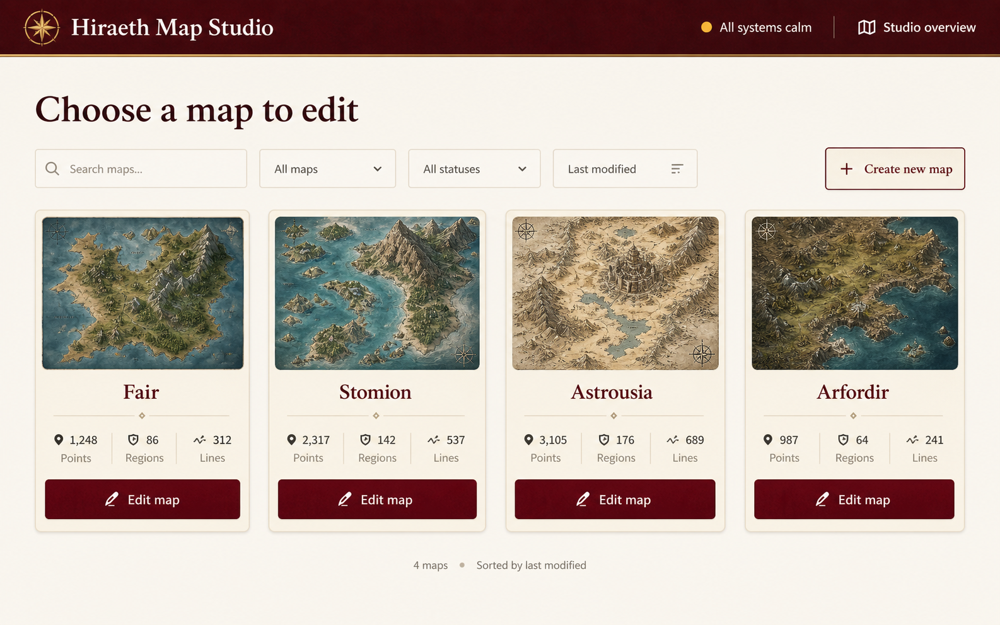
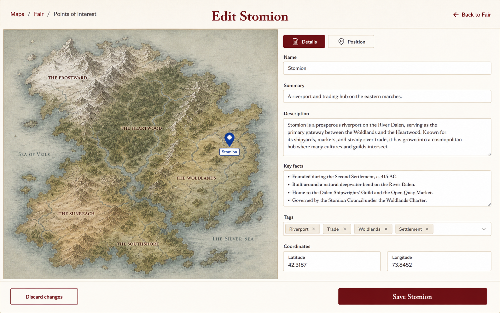

# Map Studio UX direction

These concepts were generated with OpenAI's built-in ImageGen and used as visual references for the focused Map Studio workflow. They are inspiration artifacts, not screenshots of the implementation.

## Workflow principles

1. Start with a searchable library of editable maps.
2. After choosing a map, show a small menu of distinct editing tasks.
3. Give map details, advanced setup, and each feature list their own focused screen.
4. When editing a feature, show only its map context and its form.
5. Keep save state persistent during an edit, but remove clean save and publishing UI from selection screens.

## Concept prompts

### Map Library

> Create a polished desktop web-app UX concept for Hiraeth Map Studio. The screen has one purpose: choose a map to edit. Use a warm parchment-and-oxblood visual system, a restrained top bar, a clear "Choose a map to edit" heading, search, and a spacious grid of map cards with miniature fantasy-map artwork, map name, short description, and one Edit map action. Do not show a map canvas, inspector rail, publishing dashboard, or global editing tools. Make it calm, practical, and appropriate for an internal worldbuilding tool.

### Focused feature editor

> Create a polished desktop web-app UX concept for editing one point of interest in Hiraeth Map Studio. Use the same warm parchment-and-oxblood visual system. Show a minimal breadcrumb and title such as "Edit Stomion," a large map context taking roughly 58 percent of the workspace, and a focused Details and Position form taking roughly 42 percent. Include a clear bottom save/discard area. Do not show an atlas tree, publish dashboard, global settings, unrelated feature list, or unrelated editing tools. The selected feature should be the only editing subject on the page.

